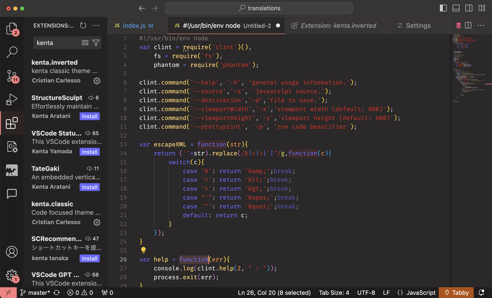
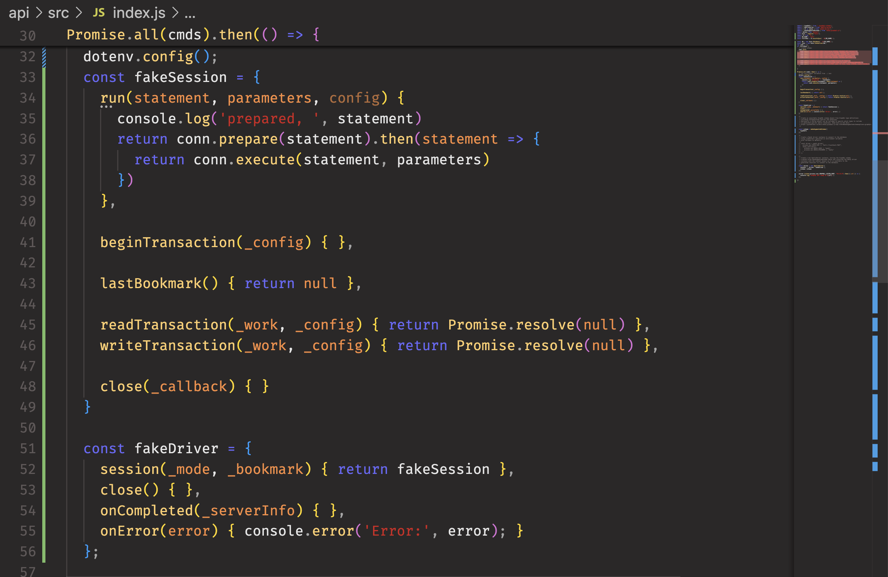
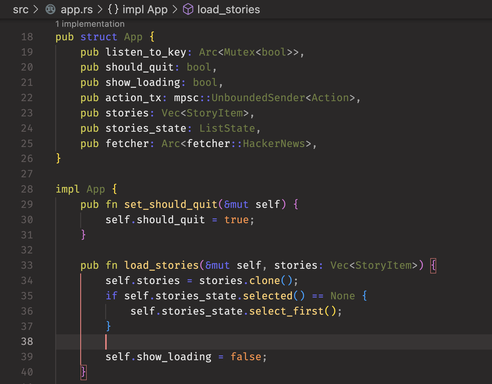

# kenta-classic README

Code focused theme I originally made for VS2003/VS2005 ported to VSCode via the `Theme Generator` extension.

Originally this colour scheme was made by me for Visual Studio 2003/2005 for C# and JavaScript.
Colour was choosen for working with a dark theme on a matte screen, in particular strings were choosen to be red and keyword purple as to quickly identify part of the code just by visually scanning them.

Comments are dark on purpose, still readable but normally they don't create visual noise.

Example full UI (old JS code):

Example of JavaScript:

Example of rust:
