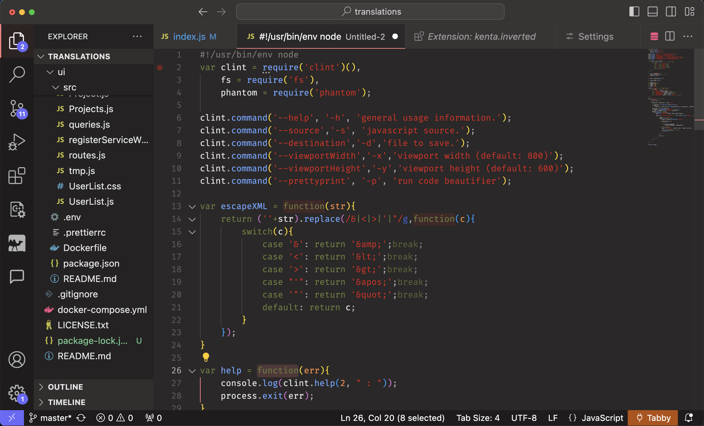
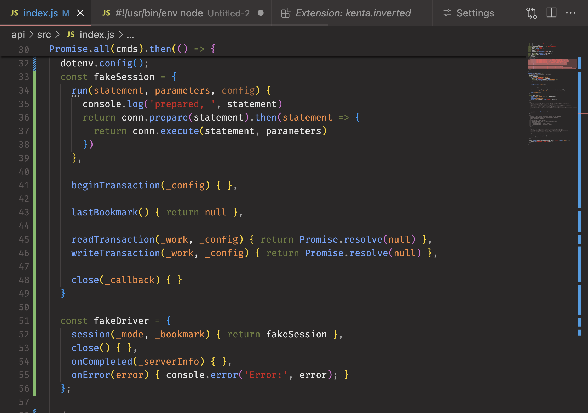
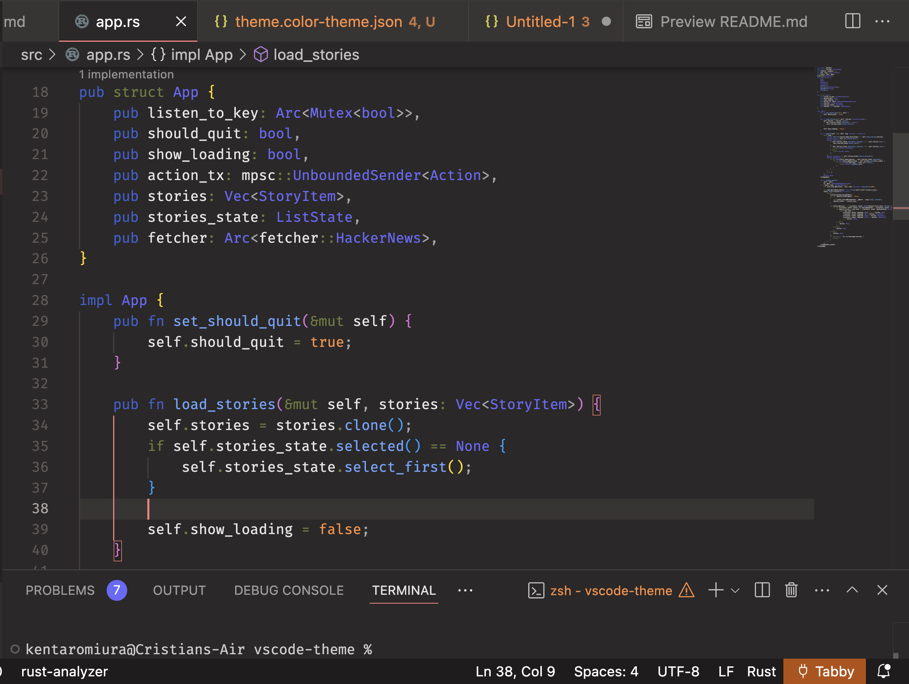

# kenta-inverted README

Altenative scheme of `kenta-classic` with inverted colour to give more weight to Types rather than strings.

Example full UI (old JS code):

Example of JavaScript:

Example of rust:
